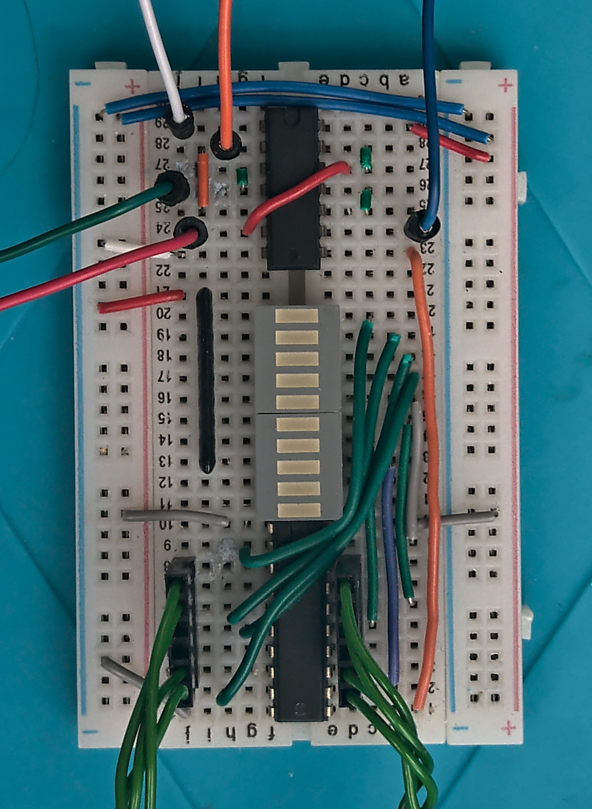

# A simple debug output port for homebrew 8-bit computers

This is a quick write-up of a very simple circuit that I've been using for years to debug my 6502-based homebrew computer projects.

I made it at first as a quick and dirty way to check my programs were working, before I had more capable output devices, but even now
I still fall back to it time and time again when things aren't working as they should, as it's a very reliable low-level low-overhead
way to get debug data, progress indication, etc from a program with just a single line of 6502 assembler to register a value.

## How it works

The idea is that, as far as address decoding goes, this shadows something read-only, such as your main ROM, so that any attempt to write to 
your ROM's address space causes the value written to get latched into this circuit and visualized on the LEDs.  You can then use this how you 
wish, anywhere in your code.

This leads to a very simple circuit, without needing to complicate your existing address decoding logic.  The only glue logic needed is a few 
NAND or OR gates, which you probably have spares of already.

## The circuit

 

The required inputs are:
* CPU's PHI2 signal (orange wire at top)
* CPU's R~W signal (white wire at top)
* CPU's A15 address bus line (blue wire at top) - or some other chip-select signal, basically whatever you wire CS to on your ROM chip
* Data to log (green twisted wires at bottom) - usually the CPU's data bus, but see below for other options

There are also two output signals:
* ~READ goes low when PHI2 is high and the CPU is trying to read from the data bus (green wire to left)
* ~WRITE goes low when PHI2 is high and the CPU is trying to write to the data bus (red wire to left)

These come from the first two NAND gates in the schematic, and are general purpose - I usually build them into my fundamental computer design, 
rather than consider them part of the debug port.  I use them to drive the ~OE and ~WE signals on all my memory chips, and other devices which 
work that way.

I've included them here anyway, in case your computer design doesn't have them (e.g. Ben Eater's doesn't do it this way).

## Hooking it up

You need to ensure that your ROM doesn't output to the data bus unless the CPU is in a read cycle.  Normally this would be the case but some 
designs, such as Ben Eater's, have the ROM's ~OE line hard-wired low.  If this is the case for your design, you need to disconnect that, and 
let this circuit drive it instead, from the ~READ output.  IMHO this is better practice in any case, and I build all my 6502-based circuits 
this way, whether the debug port is connected or not.

Next you need to provide an active-high (!) chip-select signal to the debug port.  In the schematic above, I'm using A15 for this, unadorned.  
It's treated as active-high - so any write to an address from $8000-$ffff will get logged on the debug port.  You can pick a different signal
though if you have one; you can just invert your ROM's ~CS signal for example and that should work fine.

Then you need to hook up the PHI2 signal (either the input to the CPU, sometimes called phi0, or the CPU's phi2 output) and the R~W signal 
(straight from the CPU).

Finally, connect the CPU's data bus to the flip-flop's inputs.  I use custom-made crimp connectors for this to make it easy to plug and unplug,
but you can use whatever works for you.

## Using it

Once it's hooked up, you should find your programs still run fine without any modifications.  But if you add any instructions to your programs 
that write to ROM, you should find the value written appears on the LEDs.

For example, my OS code writes a fixed value to the port, so I can tell at least that much ran; then I write distinct values as I initialize various 
subsystems.  This means that any hangs during those initializations cause a value to remain on the LEDs which helps to diagnose which system failed.

I also have default IRQ and NMI handlers that write particular values to the ports, in case my program doesn't implement its own handlers.  
This makes it easy to tell if one fired.  My IRQ handler also detects BRK, reads the following byte, and latches that to the debug port, so I can
crudely report errors with just a BRK instruction followed by a number.

For general progress tracking, I just write increasing sequences to the port so that I can tell at a glance that my program is still running, and 
(sometimes) how much progress it has made - very useful in soak tests where you leave it running for hours and want to know if it crashes.

## Specific notes on use with Ben Eater's 6502 project

If you're using this with Ben Eater's 6502 project, please note that he cut a corner and wired his ROM ~OE line permanently low.  He assumes that 
your code will never try to write to ROM; it's a dangerous assumption though, and means that if your code does try to write to ROM, it could 
damage the ROM and 6502.  So you need to instead connect the ROM's ~OE line to the ~READ output from this circuit (green wire in my breadboard image above).

## Logging more bits of data

As it stands this supports logging 8-bits of data.  I have made wider versions though - you can do this in a few ways:

### Log the address bus as well

This is very easy.

As this is all write-only, you can use the address written to as part of the data to log.  Just add another 74xx273 (or two more!) and wire it up the same 
way, but using the low (or high) 8-bits of the address bus as its input.  Now whenever you write a value, the port will log the value and the address 
written to.

You can use the address portion to record 15 bits of constant data (i.e. identifying where in your code this log is coming from) while you store 8 bits of
variable data to the port:

  ; Log A's current value with constant a reason code of $c0de
  sta $c0de

You can also record 7 bits of constant data with a variable number up to 255 taken from an index register, along with A of course:

  ; Log constant reason code $99, with current values of X and A
  sta $9900,x
  
  ; Log 16-bit value from address $220, with constant reason code $ff
  lda $220
  ldx $221
  sta $ff00,x

And at a pinch you can log 23 bits of variable data, but you need to set it up in memory first and then do an indirect sta, so it's more hard work.

### More powerful decoding

This is harder but gets you more ports.

If you want a lot more debug ports, you can use address lines to select which port gets used.  A simple way is to use one address line per port.  A15 has 
to be high of course, but you can use A14, A13, ..., A2, A1, A0 to select between up to 15 debug ports.  Then you can write to them individually:

  DEBUG0 = $8001  ; or $fffe
  DEBUG1 = $8002  ; or $fffd
  ...
  DEBUG10 = $8400 ; or $fbff
  
  ; Log A to debug port 0, X to port 1, Y to port 10
  sta DEBUG0
  stx DEBUG1
  sty DEBUG10

Note that it's up to you whether the ports are selected by high or low signals on the address lines, hence the comments showing alternate addresses for the ports

### Full address decoding

This is a little harder, requiring more support chips, but lets you embed a large number of ports compactly in a tight portion of memory-mapped address space.

For this you can use a 74xx138 to decode three address lines into eight outputs, and use those to drive your debug 
ports.  You can cascade three or four 74xx138s with very little glue logic to decode 24 or 32 outputs.  This is a very standard arrangement - see the datasheet for details.
Then your debug ports are all available with sequential memory-mapped addresses rather than being spread out as above.

As usual there are many options, and lots of room for experimentation and choosing what suits you best!

## Comments and feedback

I'm interested to hear if you find this useful, if you find any errors in the circuit or this description, etc.  So please let me know.  Raise an issue 
I guess, even if you just want to chat, and we can sort something out!

